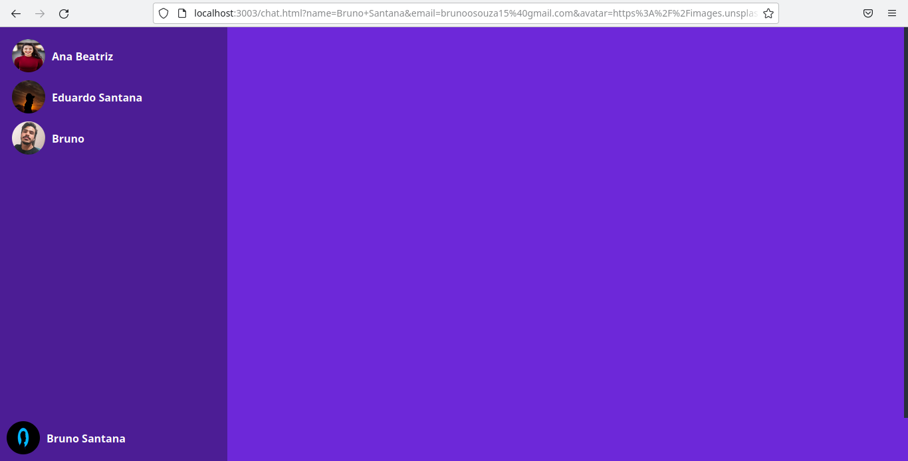
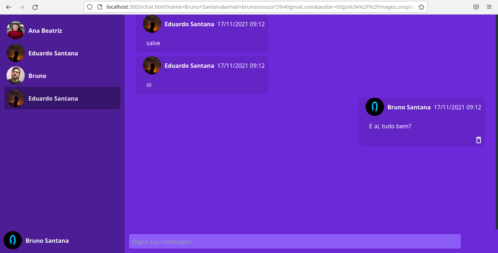
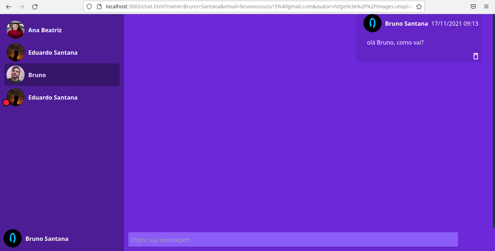

<h1 align="center">
	
</h1>

<h3 align="center">
  Rocketsocket
</h3>

<p align="center">
  
  
  
  
  <a href="https://github.com/BrunoSSantana/rocketsocket/commits/master">
    
  </a>
  
  <a href="https://github.com/BrunoSSantana/rocketsocket/issues">
    
  </a>
  
  
</p>

<p align="center">
  <a href="#-about-the-project">About the project</a>&nbsp;&nbsp;&nbsp;|&nbsp;&nbsp;&nbsp;
  <a href="#-technologies">Technologies</a>&nbsp;&nbsp;&nbsp;|&nbsp;&nbsp;&nbsp;
  <a href="#-getting-started">Getting started</a>&nbsp;&nbsp;&nbsp;|&nbsp;&nbsp;&nbsp;
  <a href="#-license">License</a>&nbsp;&nbsp;&nbsp;|&nbsp;&nbsp;&nbsp;
  <a href="#-author">Author</a>
</p>


## 📜 About the project

This project aims to create a private chat between two application users who are registered in a database.



When entering the application they will always provide the same data, if you enter the same email and change the name, this new name will be the name used within the application.


The chat features new unread message notification, a red dot at the bottom left of the chat photo of the user who sent the message. 


---
## 🚀 Technologies

Technologies that we used to develop this api

- [Node.js](https://nodejs.org/en/)
- [TypeScript](https://www.typescriptlang.org/)
- [Express](https://expressjs.com/pt-br/)
- [Prisma](https://prisma.io/#/)
- [SQLite](https://www.sqlite.org/)
- [ts-node-dev](https://www.npmjs.com/package/ts-node-dev)
- [Axios](https://github.com/axios/axios)
- [Tailwind](https://tailwindcss.com/)

## 💻 Getting started

### Requirements

- [Node.js](https://nodejs.org/en/)
- [Yarn](https://yarnpkg.com/) or [npm](https://www.npmjs.com/)


**Clone the project and access the folder**

```bash
$ git clone https://github.com/Bruno/rocketsocket.git && cd rocketsocket
```

**Clone by GitHub CLI:**
```bash
$ gh repo clone BrunoSSantana/rocketsocket
```
**Follow the steps below**

```bash
# Install the dependencies
$ yarn

# Once the services are running, run the migrations
$ yarn prisma migrate dev

# To finish, run the api service
$ yarn dev

# Well done, project is started!
# Open the application in your browser on port 3003 with http://localhost:3003/
```

## 📝 License

This project is licensed under the MIT License - see the [LICENSE](LICENSE) file for details.

---
## 👨🏻‍💻 Author
<a href="https://github.com/BrunoSSantana/">
 
 <br />
 <sub><b>Bruno Santana</b></sub></a> <a href="https://github.com/BrunoSSantana/" title="Rocketseat">🚀</a>

Made with 💜 by Bruno Santana 👋🏽

[⬆ Back to the top](#-about-the-project)
